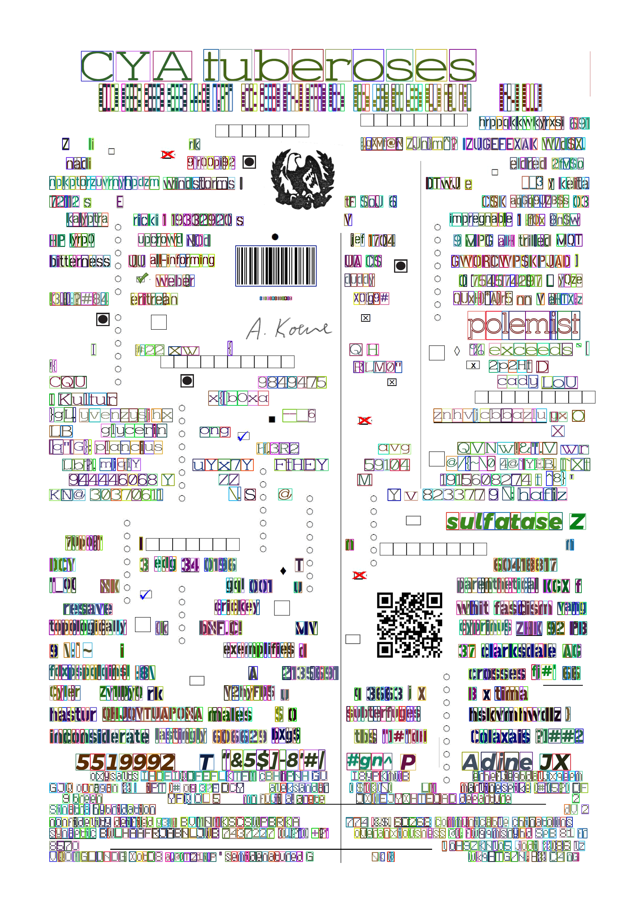
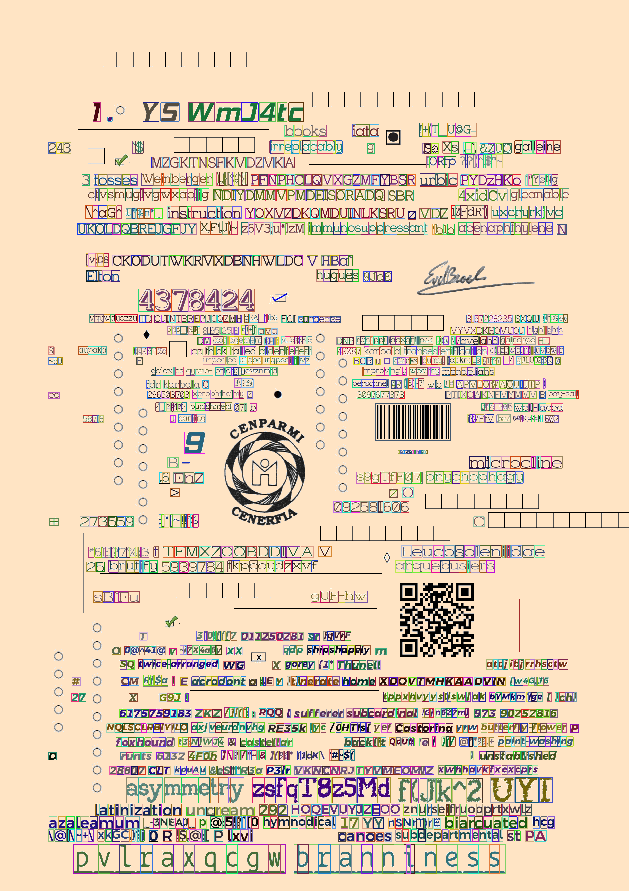
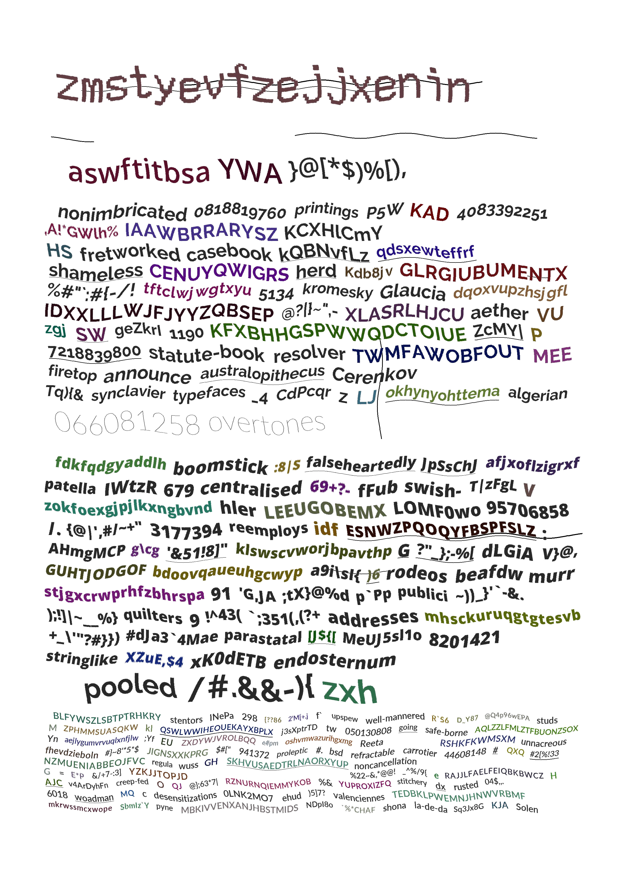

# Document-Understanding
Aimed at creating configurable largest ever Datasets for Document understanding.Document understanding Synthectic dataset generation(Millions of synthetically annotated Document images) for Text graphic separator.
Table detection, Graphical Entities Detection and recogntion (Deep learning) by Fine tuning CRAFT.
Datasets collection and synthetic generation of Annotated dataset.  

Novel Methodolgy for Synthetic Dataset generation from Ideation to development (Acknowledge my mentor's guidance and support)  
Various versions of this synthetic document Images generating tool is developed.  

Note : Initially, Deep models were trained using Tensorflow object detection API, Yolo V3 but later approach shifted on Fine tuning CRAFT, which is based on Affinity between characters and words.

## This Tool can generate as many distinct documents as the storage space will allow with all Annotations (char level, word level, Graphical entities, lines, noise, blurness, dullness)

## This makes this tool a candidate for creating the largest ever completely annotated Datasets for All kind of Document Understanding tasks.

## Note: This Research work is under development and yet to be published/patented to be made public and is done in association with Industry.The source code is not public because of Copyrights.

 
Following type of background are supported:
 - white background
 - colored background (As in case of magazines, scientific journals etc.)
 - background with random Gaussian noise
 - 2D deformations at page level (sine wave, cosine wave)
 - Brightness/dullness/Blurness Augmentations
 
Following Classes are supported:
- char
- word
- Qr Code
- Barcode
- Signature
- Logos
- check boxes
- Stamps
- Tables
- lines
- graphical elements
Figures

Bag of words for 196 Fonts and 38 font sizes combinations i.e. 7448 bag of words, Each bag of word with 24 categories with variation as:
- All combinations of Alpha, Num and Symbols
- All combinations of character spacing, Case(uppercase, lowercase), length of words(1-20) 
- <b> Appx. 625 Million images of words generated </b> which is used to generate Document images.

## white bg Image with char level annotations

## white bg Image with all other graphical entities like sign, logo, barcode, qrcode, checkboxes and lines
 
## Colored bg Image with char level annotations

## Colored bg Image with all other graphical entities like sign, logo, barcode, qrcode, checkboxes and lines
 
## 2D deformations like Sine wave, cosine wave etc.
 
## Annotation visualiser webapp (Flask based)
<b>Deployed on Heroku</b> [link](https://annotation-visualiser-app.herokuapp.com/)
