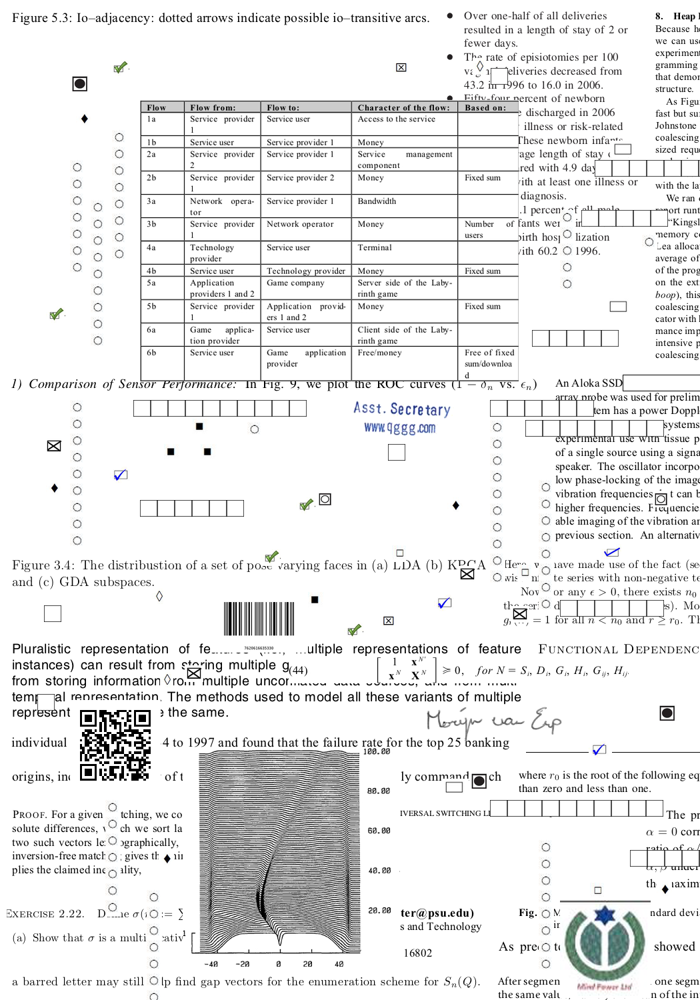
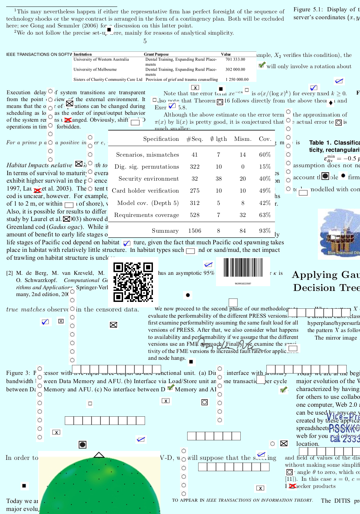
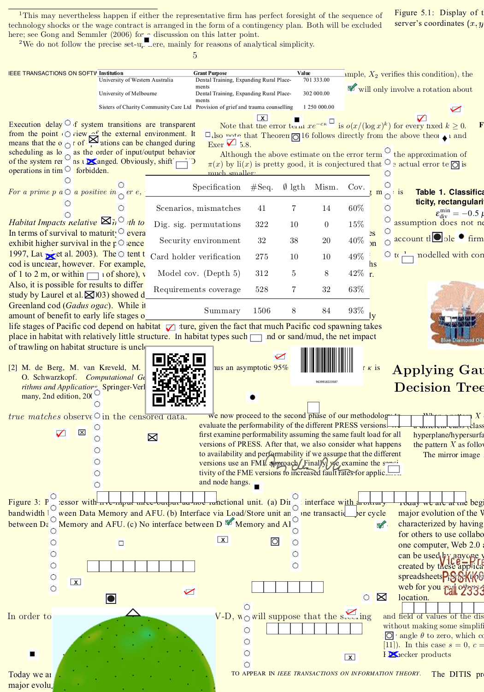

# Document-Understanding
Document understanding Synthectic dataset generation(Millions of synthetically annotated Document images) for Text graphic separator.
Table detection, Graphical Entities Detection and recogntion (Deep learning)
Datasets collection and synthetic generation of Annotated dataset.  

Own IPR for my Novel Methodolgy for Synthetic Dataset generation from Ideation to development (Acknowledge my mentors guidance and support)  
Various versions of this synthetic document Images generating tool is developed.
Following Classes are supported:
- char
- word
- Qr Code
- Barcode
- Signature
- Logos
- check boxes
- Stamps
- Tables and Documents

Figures

## Generating dataset with Random background color
 <b>To make trained model robust to background color variations</b>
 
 
## Annotation visualiser webapp (Flask based)
<b>Deployed on Heroku</b> [link](https://annotation-visualiser-app.herokuapp.com/)
